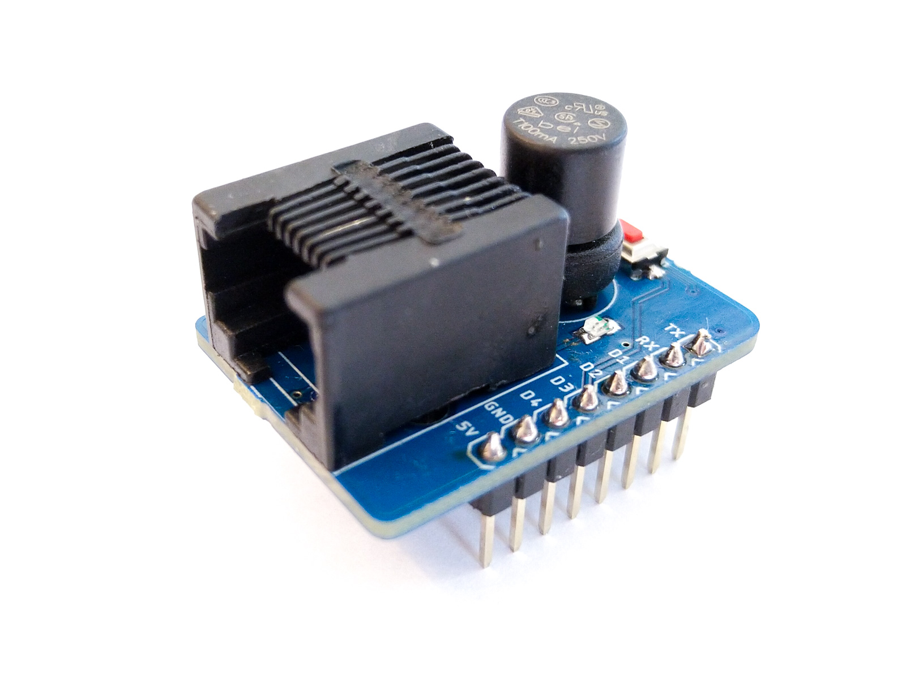
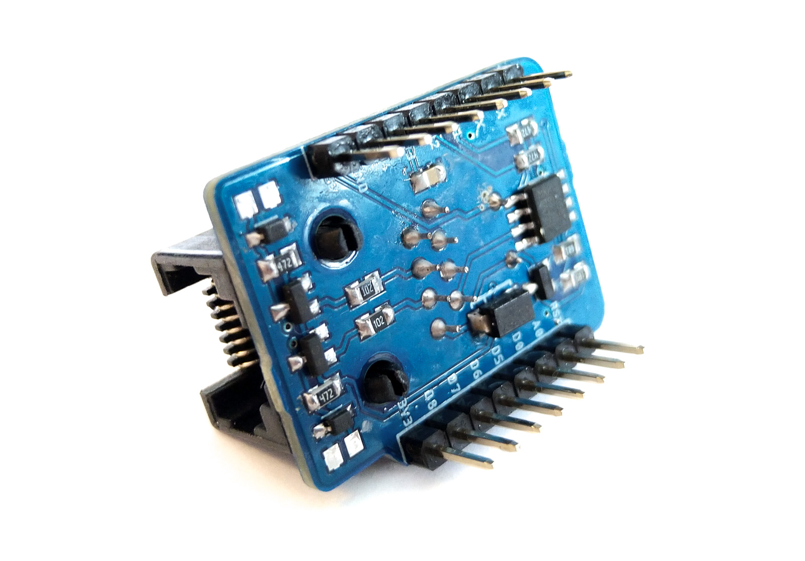
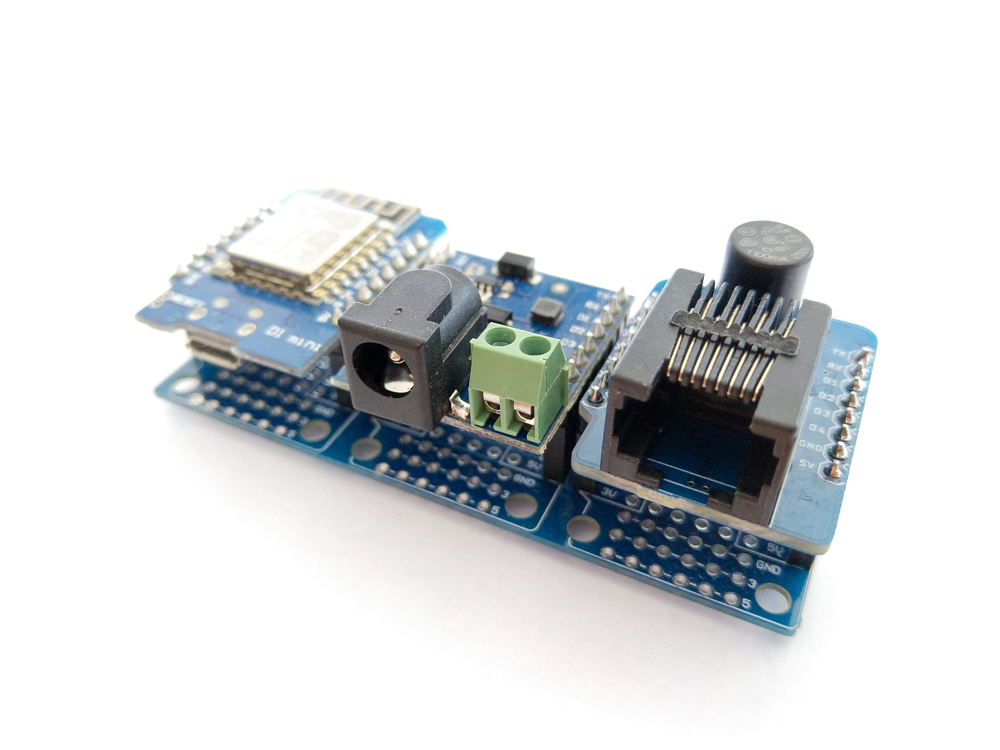
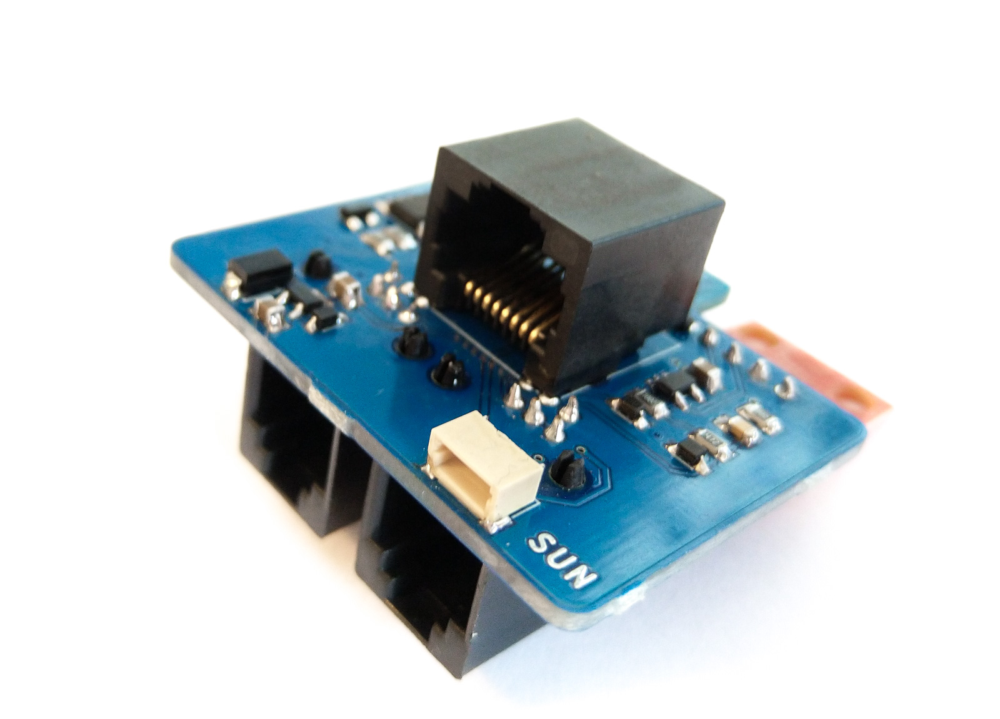
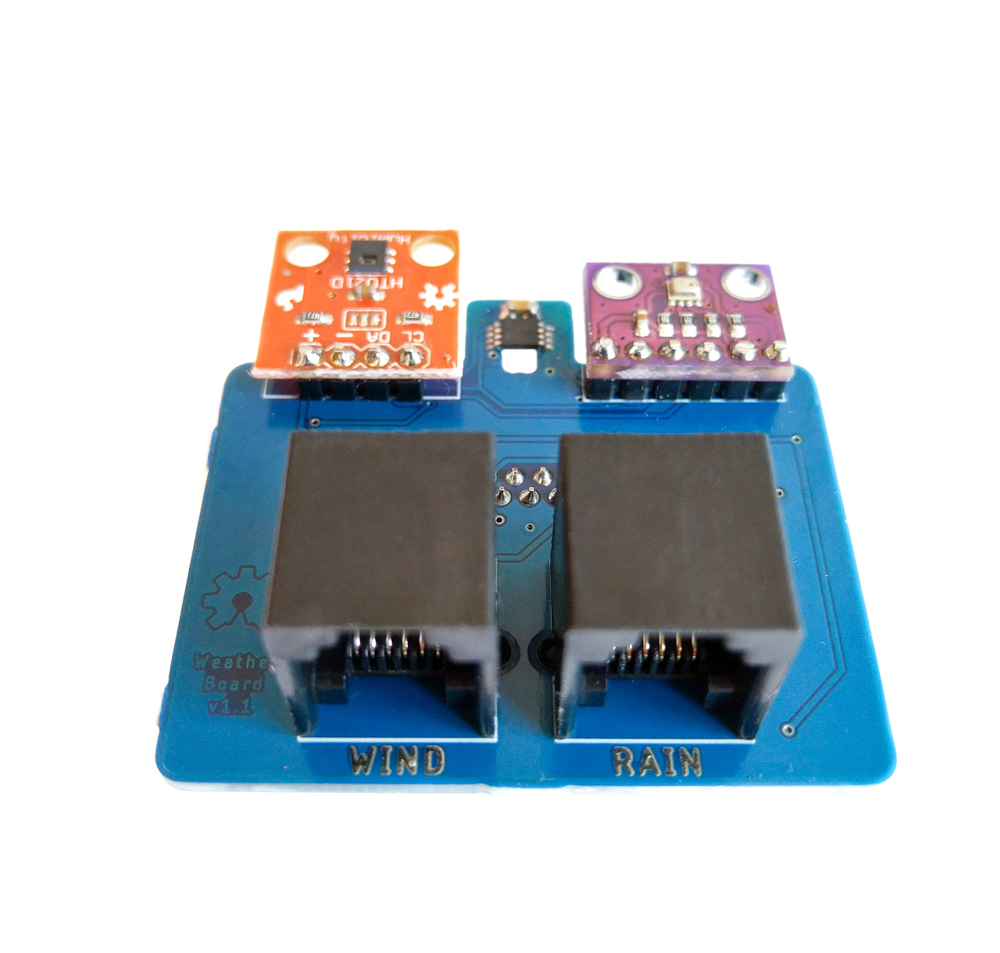

# WeMos weather station
[](https://travis-ci.org/pilotak/WemosWeatherStation)

An all-in-one ESP8266 based weather station. Hardware configuration is split into two parts due to easier maintenance in case of ESP8266 failure and fuse replacement (the board outside is protected against lighting). FW can easily be compiled by PlatformIO or Arduino IDE if necessary, otherwise can be downloaded in [release page](./releases).

Data are sent over MQTT where [Telegraf](https://www.influxdata.com/time-series-platform/telegraf/) is waiting to push data to [InfluxDB](https://www.influxdata.com/time-series-platform/influxdb/) and [Grafana](https://grafana.com/) tool to render charts.

**Main futures:**
- Easy configuration via [WiFiManager](https://github.com/tzapu/WiFiManager)
- WeMos based shield
- WH1080 mechanical components for rain, wind measurements and radiation shield
- MCP9808: high precision temperature sensor
- HTU21D: humidity sensor
- BMP280: pressure sensor
- Output data is via MQTT
- supports HTTP OTA

## Wemos-meteo shield
Based on my libraries:
- [WeatherMeters](https://github.com/pilotak/WeatherMeters)
- [MeteoFunctions](https://github.com/pilotak/MeteoFunctions)

### MQTT topics:
#### `name/status`
If online:
`sensors` key: binary map of sensors state (OK=1, failure=0)
```json
{
  "status": 1,
  "ip": "192.168.1.7",
  "rssi": -10,
  "sensors": 7
}
```

otherwise:
```json
{
  "status": 0
}
```

#### `name/sensors`
If any of the value can't be calculated, it sends `NaN`
```json
{
  "humidity": 79.84,
  "pressure_rel": 1021.85,
  "pressure_abs": 967,
  "dew": 2.1,
  "humidex": 3.69,
  "heat": 3.97,
  "cloud": 390.13,
  "temp": [
    5.3,
    5.36,
    5.43
  ]
}
```

#### `name/upgrade`
As a data send link to `*.bin` upgrade package and it will reply in topic `name/upgrade/status`

#### `name/height`
As a data send new height and it will confirm in topic `name/height/new`

<table border="0">
 <tr>
    <td></td>
    <td></td>
 </tr>
 <tr>
    <td colspan="2"></td>
 </tr>
</table>

## Weather board
Fits directly into radiation shield, just connect wind sensors, rain gauge bucket and you ready to measure. For future i have included extention connector for measuring sun light and UV index.

<table border="0">
 <tr>
    <td></td>
    <td></td>
    <td></td>
 </tr>
</table>

## Server configuration
Below you can find a `docker-compose.yaml` file for fast integration onto your server.
```yaml
version: "3.6"

services:
  mosquitto:
    container_name: mosquitto
    restart: always
    image: eclipse-mosquitto
    ports:
      - 1883:1883
    volumes:
      - ${DOCKER_PATH}/mosquitto/mosquitto.conf:/mosquitto/config/mosquitto.conf
      - ${DOCKER_PATH}/mosquitto/pwfile:/mosquitto/config/pwfile
      - ${DOCKER_PATH}/mosquitto/data:/mosquitto/data

  influxdb:
    container_name: influxdb
    restart: always
    image: influxdb:alpine
    environment:
      - INFLUXDB_REPORTING_DISABLED=true
      - INFLUXDB_DB=${INFLUX_DB}
      - INFLUXDB_ADMIN_USER=${INFLUX_ADMIN_USER}
      - INFLUXDB_ADMIN_PASSWORD=${INFLUX_ADMIN_PASSWORD}
      - INFLUXDB_USER=${INFLUX_USER}
      - INFLUXDB_USER_PASSWORD=${INFLUX_PASSWORD}
      - INFLUXDB_READ_USER=${INFLUX_READ_USER}
      - INFLUXDB_READ_USER_PASSWORD=${INFLUX_READ_PASSWORD}
      - INFLUXDB_WRITE_USER=${INFLUX_WRITE_USER}
      - INFLUXDB_WRITE_USER_PASSWORD=${INFLUX_WRITE_PASSWORD}
      - INFLUXDB_HTTP_AUTH_ENABLED=true
    volumes:
      - ${DOCKER_PATH}/influxdb:/var/lib/influxdb
    ports:
      - 8086:8086

  grafana:
    container_name: grafana
    restart: always
    image: grafana/grafana
    depends_on:
      - influxdb
    environment:
      - GF_ANALYTICS_REPORTING_ENABLED=false
      - GF_ANALYTICS_CHECK_FOR_UPDATES=false
      - GF_SECURITY_DISABLE_GRAVATAR=true
      - GF_SNAPSHOTS_EXTERNAL_ENABLED=false
      - GF_AUTH_ANONYMOUS_ENABLED=true
      - GF_AUTH_ANONYMOUS_ORG_NAME=${INFLUX_DB}
      - GF_AUTH_ANONYMOUS_ORG_ROLE=Viewer
      - GF_AUTH_DISABLE_SIGNOUT_MENU=true
      - GF_AUTH_BASIC_ENABLED=false
      - GF_SERVER_ROOT_URL=https://meteo.${MY_DOMAIN}
    volumes:
      - ${DOCKER_PATH}/grafana:/var/lib/grafana
    ports:
      - 3000:3000

  telegraf_meteo:
    container_name: telegraf_meteo
    restart: always
    image: telegraf:alpine
    depends_on:
      - influxdb
      - mosquitto
    volumes:
      - ${DOCKER_PATH}/telegraf/meteo.conf:/etc/telegraf/telegraf.conf:ro

```

